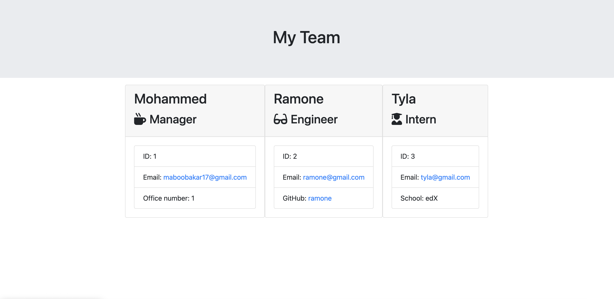

# Team Profile Generator

The challenge was to build a application that generates HTML files using input from a command-line interface. This application will take in information about employees on a team, then generate an HTML webpage that displays summaries for each person.

## Screenshot

## Installation
The GitHub repository for my Readme Generator can be found at: https://github.com/mohammed45a/team-profile-generator

## Usage
Link to my GitHub Repository: https://github.com/mohammed45a/team-profile-generator

## Credits
Inquirer.js https://www.npmjs.com/package/inquirer

Edx Classes and Starter code

Youtube!

https://developer.mozilla.org

